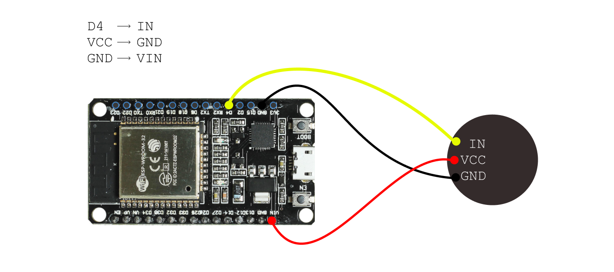

# Shadow Lamps

Instructions: 

- Board: DOIT ESP32 DEVKIT V1
- Hold Boot while sketch upload
- After upload unglug USB and then plug in again
- *install USB-UART plugin "CP210x_VCP_Windows.zip" (as Admin)





Add boards:

```bash
https://espressif.github.io/arduino-esp32/package_esp32_index.json
```
